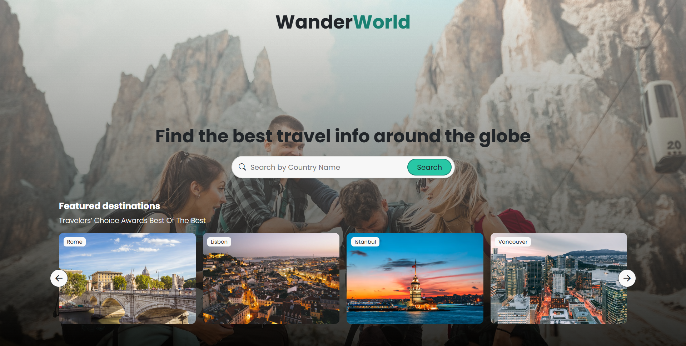

# 🌍 WanderWorld – Explore Cities Around the Globe

WanderWorld is a travel guide web app I built to strengthen my skills in working with **real-world APIs** and **object-oriented programming in JavaScript**. It allows users to search for any country and instantly view:

* ✅ A brief description (via Wikipedia API)
* 📸 Real images from Unsplash
* ☁️ 3-day weather forecast using WeatherAPI
* 🌐 Key country info (flag, capital, region, languages, currency, timezone, etc.)

I built this project using HTML, CSS (Bootstrap 5), and vanilla JavaScript. All the APIs are fetched dynamically, and I’ve focused on a smooth and responsive UI/UX.

---

## 🔧 Features

* Dynamic multi-API integration (RestCountries, Wikipedia, Unsplash, WeatherAPI)
* Custom loading animation and transitions
* Clean, responsive design with smooth carousel and sliding featured destinations
* Country data card with real-time info

---

## 🧰 Tech Stack

* HTML5
* CSS3 + Bootstrap 5
* JavaScript (ES6+)
* REST APIs

---

## 📂 Project Structure

```
📁 css
   ├── index.css
   ├── loader.css
📁 js
   ├── index.js
   ├── search.js
   ├── country.js
   ├── UI.js
   └── slider.js
📁 img
   └── landing.jpg
index.html
```

---

## 🚀 Live Demo



[Live Website](https://momen5406.github.io/wanderworld-travel-guide/)

[GitHub Repository](https://github.com/momen5406/wanderworld-travel-guide)

---

## 👨‍💼 About Me

I’m Mo’men Hussein, a passionate web developer and designer. I love mixing clean UI with functional logic and making things that feel alive. This project was a big step forward in working with real APIs and building dynamic UI components.

Feel free to check out the repo or reach out if you have feedback!

---

## 📌 License

This project is for educational purposes only. It is a non-commercial, API-integrated clone-inspired travel app.
